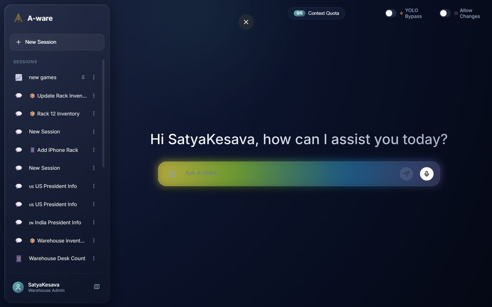
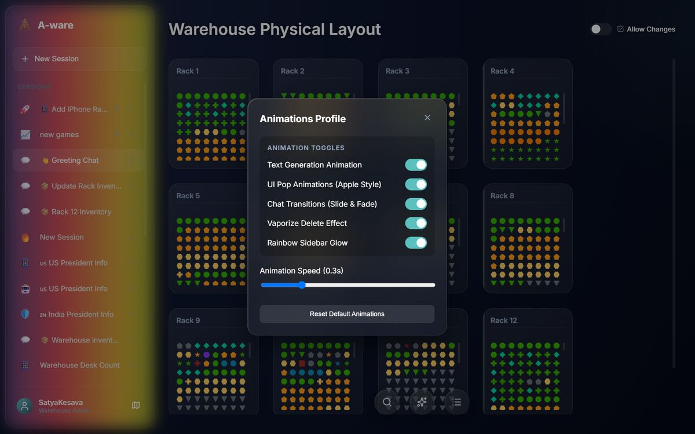
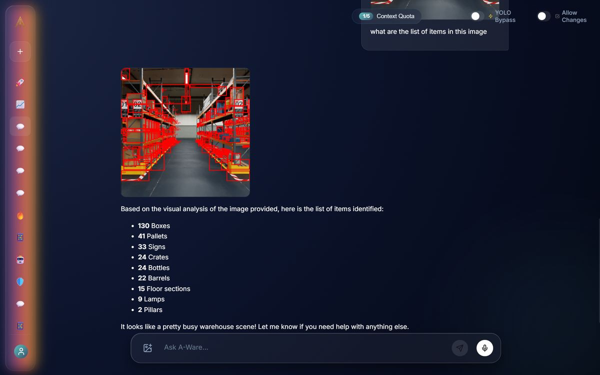
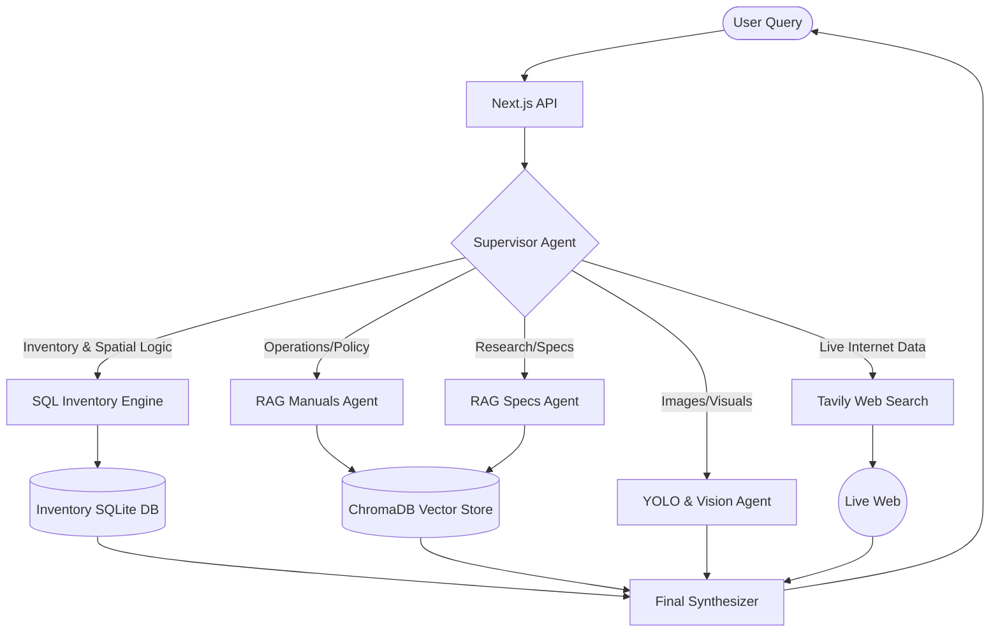
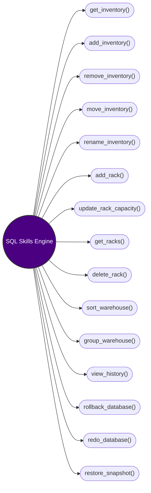

# A-ware: Multimodal Warehouse Intelligence System

A-ware is a multimodal warehouse intelligence platform that combines **multi-agent intelligent orchestration**, **synthetic data generation**, **YOLO-based object detection**, **Retrieval-Augmented Generation (RAG)**, a massive suite of **highly-tuned SQL skills**, large language models (**gemini-3.1-flash-lite**), and a **modern Glassmorphism UI**. Together, these systems create an advanced warehouse assistant capable of not just answering natural-language queries, but actively analyzing, modifying, time-traveling, and safely executing complex physical logistics operations across the entire database in real-time.

---

## 🚀 Getting Started (Installation)

We have packaged the system with a simple automated setup script so anyone can clone and run it instantly.

### 1. Clone the repository
```bash
git clone https://github.com/SatyaKesavaKorlapati/A-Ware-AI-System.git
cd A-Ware-AI-System
```

### 2. Run the Interactive Setup
Run the automated python installer. It will:
- Prompt you for your **Gemini API Key** and **Tavily API Key**.
- Automatically build your virtual environment and install all Python & Node.js dependencies.
- Optionally create an **A-Ware Launcher** shortcut directly on your Desktop for 1-click startup!

```bash
python setup.py
```

### 3. Launch the Application
If you generated the Desktop Launcher during setup, simply double-click `A-Ware Launcher.bat` on your Desktop!

Otherwise, you can run the two servers manually:

**Terminal 1 (Backend API):**
```bash
# Windows
awenv\Scripts\python app\main.py

# Mac/Linux
awenv/bin/python app/main.py
```

**Terminal 2 (Frontend UI):**
```bash
cd frontend
npm run dev
```

The application will be live at `http://localhost:3000`.

---

## 📸 Application Showcase

Check out the interactive A-Ware application in action!




**Application Walkthrough:**


---

## ✨ Major 2.0 Features & Interactive UI Overhaul

> [!TIP]
> **Interactive Markdown Rendering**
> The A-Ware UI does not just display text. It intercepts the AI's markdown stream and dynamically renders **interactive Glassmorphism React widgets** directly into the chat interface!

| Feature | Description |
| :--- | :--- |
| **Interactive Database Timeline** | Ask to see the "timeline" and the AI injects a custom, interactive glass UI widget directly into the chat! Click past database snapshots and physically restore the SQL database to an older state with a single button press. |
| **Interactive AI Permissions** | If the AI encounters a roadblock (e.g. needing more racks to group items), it halts execution and renders interactive `[Yes]` or `[No]` permission buttons in the chat stream, seamlessly resuming its logic loop based on your click. |
| **🎙️ Voice Mode** | Integrated native browser speech recognition for hands-free warehouse queries and command execution. |
| **🌐 Live Web Access** | Equipped with Tavily API integration, the AI can break out of its local RAG constraints to scrape live websites and answer real-time queries. |
| **📊 Dynamic Visual Legend** | A real-time legend panel that automatically extracts and tracks unique item properties and visual color-hashes directly from the SQL database. |
| **⚡ Real-Time Map Reactivity** | The 2D warehouse map immediately reflects backend database modifications through automatic 5-second polling hooks and a manual force-refresh action. |
| **Glassmorphism Aesthetics** | A sleek, fully responsive dark-mode chat interface with frosted glass sidebars, dynamic rainbow edge-glows, and real-time LLM typewriter animations. |

---

## 🧠 System Architecture & Agentic RAG

The Cognitive Engine is powered by a robust LangChain/LangGraph supervisor architecture. It dynamically routes queries to specialized autonomous agents equipped with distinct toolsets.

Our system abandons traditional single-vector retrieval in favor of a true **Multi-Agent RAG** architecture powered by two specialized databases.

### Dual-Database Architecture
- **🗃️ Inventory SQLite DB:** A rigorous, schema-enforced relational database managing exact counts, capacities, bounding boxes, and structural integrity.
- **🧠 ChromaDB Vector Store:** A semantic embedding database containing unstructured system manuals, operation policies, and hardware specifications.

### Core Supervisor Execution Loop


---

## 🔥 Highly-Tuned SQL Skills Engine

> [!IMPORTANT]
> The **SQL Inventory Engine** is *not* a basic LLM agent that simply guesses SQL syntax. Instead, **we leveraged the concept of skills to highly tune the function into this particular warehouse use.**

By equipping the system with a massive suite of strict procedural skills, the AI can perform complex spatial reasoning and database manipulation without hallucination.



### Advanced Engine Capabilities
- **Multi-Query Execution**: Automatically chains multiple SQL queries into a unified atomic action for complex spatial reasoning and bulk operations.
- **Mass Shifts & Deletions**: Seamlessly relocates bulk subsets of items (e.g., entire categories) while dynamically remapping physical aisle relations, and securely isolates and purges items via parameter-based subsets.
- **Bulk Insertion Optimization**: Employs SQLite `WITH RECURSIVE` Common Table Expressions (CTEs) to perform massive bulk insertions (e.g., 1000 items) flawlessly without hitting token limits.
- **`group_warehouse` Algorithm**: Iterates over every category in the warehouse and isolates them so one rack holds *only* one item type. It intelligently asks for user permission via interactive chat buttons if it runs out of physical rack space.
- **`sort_warehouse` Algorithm**: A dense-packing spatial algorithm that mathematically shifts items across the grid to free up as many empty racks as possible.
- **Greedy Distribution** (`add_inventory`): Automatically splits massive shipments (e.g., 5000 items) across multiple available racks perfectly if a single rack hits its capacity limit.
- **Snapshot Time-Travel** (`restore_snapshot`, `view_history`, `rollback`): The engine automatically maintains a shadow log of database states. This enables the Interactive Timeline, allowing users to view the entire history of the database and interactively restore specific historical snapshots with perfect accuracy.
- **Anti-Hallucination Measures**: Hardcoded Database Triggers physically block the AI from violating warehouse capacities (e.g., 600 items max per rack).

> [!TIP]
> **Complete Capabilities & Demo Script**
> For an exhaustive breakdown of every capability, refer to the [System Features Breakdown](data/manuals/features.md).
> To test the intelligence of the system yourself, run through the [Interactive Demo Questions](data/manuals/warehouse_ai_demo_questions.md).

---

## 📦 Synthetic Data & Vision Models

### Dataset Generation
#### Simulator Setup
- NVIDIA Isaac Sim
- USD-based warehouse environment
- omni.replicator.core for synchronized capture

#### Camera Setup
- 22 static warehouse cameras
- 1 scripted drone camera
- Multi-view warehouse coverage

#### Captured Modalities
Each frame contains:
- RGB image
- Bounding box annotations
- Instance segmentation
- Semantic segmentation
- Metric depth maps

#### Dataset Variants
| Dataset | Frames | Classes |
|---|---|---|
| warehouse-bb | 880 | 28 |
| warehouse-bb-4 | 880 | 21 |
| masterwarehouse-2640 | 2640 | 21 |

#### Structural Class Filtering
The pipeline removes structural classes such as floor, wall, ceiling, rack, background. This improved recall by approximately 2.3×.

---

### 🔍 YOLO26 Training

#### Final Production Model
| Metric | Value |
|---|---|
| Model | YOLO26-L |
| Precision | 0.919 |
| Recall | 0.697 |
| mAP50 | 0.735 |
| mAP50-95 | 0.612 |
| Image Size | 1280 |
| Epochs | 100 |

#### Training Improvements
Key optimizations:
- High-resolution training (1280px)
- Structural class filtering
- Larger dataset size
- Higher IoU threshold
- Drone-based aerial viewpoints

---

## 🛠️ Technologies Stack

### Frontend
- **Framework:** Next.js, React
- **Styling:** CSS3 Glassmorphism

### Backend
- **Framework:** Python, FastAPI
- **Database:** ChromaDB (Vector DB), SQLite (Inventory DB)
- **Simulation:** NVIDIA Isaac Sim, USD, omni.replicator.core

### 🤖 AI Models Config
- **LLM:** gemini-3.1-flash-lite
- **Embedding:** gemini-embedding-2
- **Vision:** YOLO26-L (LAR1r)

---

## 📂 Project Archive & Resources
Complete project resources including raw datasets, processed datasets, YOLO model weights, demonstration videos, and additional files:

Google Drive Archive:
https://drive.google.com/drive/folders/1X2DTqPRzyYZypY-2txkBtzWPYZyk-N51?usp=sharing
