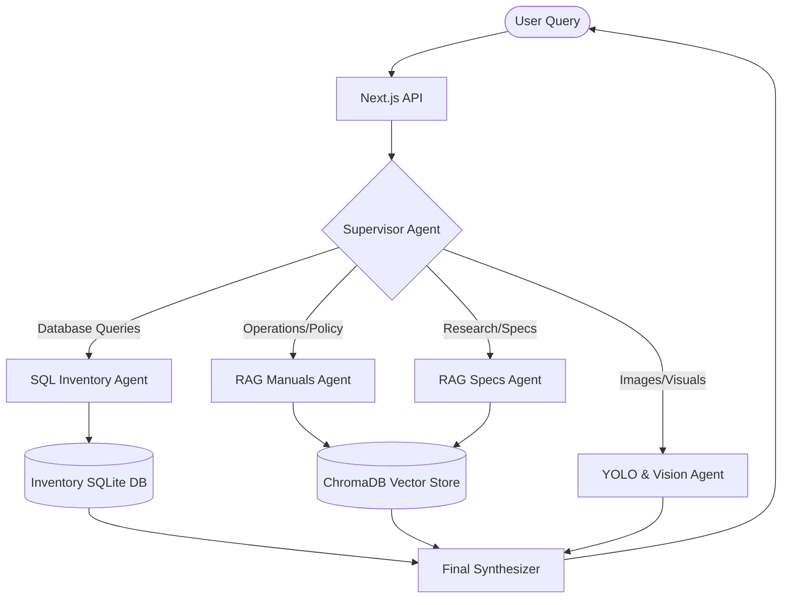
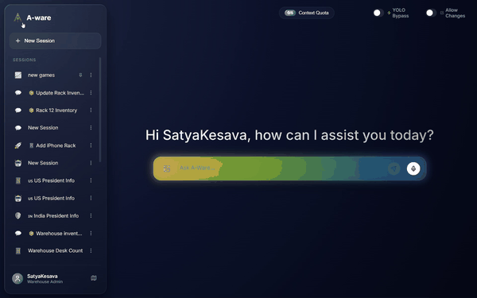

# A-ware: Multimodal Warehouse Intelligence System

A-ware is a multimodal warehouse intelligence platform that combines a **modern Apple-style Glassmorphism UI**, synthetic data generation, YOLO-based object detection, Retrieval-Augmented Generation (RAG), and large language models (Gemini Pro) to create an intelligent warehouse assistant capable of answering grounded natural-language inventory queries.

---

## 🚀 Getting Started (Installation)

We have packaged the system with a simple automated setup script so anyone can clone and run it instantly.

### 1. Clone the repository
```bash
git clone https://github.com/SatyaKesavaKorlapati/A-Ware-AI-System.git
cd A-Ware-AI-System
```

### 2. Run the Interactive Setup
Run the automated python installer. It will:
- Prompt you for your **Gemini API Key**.
- Automatically build your virtual environment and install all Python & Node.js dependencies.
- Optionally create an **A-Ware Launcher** shortcut directly on your Desktop for 1-click startup!

```bash
python setup.py
```

### 3. Launch the Application
If you generated the Desktop Launcher during setup, simply double-click `A-Ware Launcher.bat` on your Desktop!

Otherwise, you can run the two servers manually:

**Terminal 1 (Backend API):**
```bash
# Windows
awenv\Scripts\python app\main.py

# Mac/Linux
awenv/bin/python app/main.py
```

**Terminal 2 (Frontend UI):**
```bash
cd frontend
npm run dev
```

The application will be live at `http://localhost:3000`.

---

## ✨ New Features & UI Overhaul
- **Apple-Style Glassmorphism UI:** A sleek, fully responsive dark-mode chat interface with frosted glass sidebars.
- **Dynamic Rainbow Glow:** A beautiful, non-intrusive animated rainbow edge glow that can be toggled via the user profile.
- **Custom Chat Emojis:** Sessions now automatically assign custom emojis to conversations based on context, which you can manually edit with a 15+ animated emoji picker.
- **Smart Chat Typist:** Text generation animations play in real-time for new messages and load instantly when viewing old histories.
- **Interactive Sidebar:** Drag-to-resize support, compact-mode collapsing, and centered adaptive layouts.

---

## 🧠 System Architecture

The Cognitive Engine is powered by a robust LangChain/LangGraph supervisor architecture:



The system combines YOLO detections, precise SQL Spatial Constraints (e.g., 600-item rack limits), Vector semantic retrieval, and Gemini-based reasoning to safely execute complex warehouse operations.

---

## 📦 Dataset Generation

### Simulator
- NVIDIA Isaac Sim
- USD-based warehouse environment
- omni.replicator.core for synchronized capture

### Camera Setup
- 22 static warehouse cameras
- 1 scripted drone camera
- Multi-view warehouse coverage

### Captured Modalities
Each frame contains:
- RGB image
- Bounding box annotations
- Instance segmentation
- Semantic segmentation
- Metric depth maps

### Dataset Variants
| Dataset | Frames | Classes |
|---|---|---|
| warehouse-bb | 880 | 28 |
| warehouse-bb-4 | 880 | 21 |
| masterwarehouse-2640 | 2640 | 21 |

### Structural Class Filtering
The pipeline removes structural classes such as floor, wall, ceiling, rack, background. This improved recall by approximately 2.3×.

---

## 🔍 YOLO26 Training

### Final Production Model
| Metric | Value |
|---|---|
| Model | YOLO26-L |
| Precision | 0.919 |
| Recall | 0.697 |
| mAP50 | 0.735 |
| mAP50-95 | 0.612 |
| Image Size | 1280 |
| Epochs | 100 |

### Training Improvements
Key optimizations:
- High-resolution training (1280px)
- Structural class filtering
- Larger dataset size
- Higher IoU threshold
- Drone-based aerial viewpoints

---

## 🗄️ RAG Knowledge Base

### ChromaDB Metadata Index
The warehouse metadata contains:
- 2,754 indexed warehouse objects
- Spatial coordinates
- Rack and aisle mapping
- Shelf-level information
- Semantic text descriptions

### Two-Layer Retrieval Architecture
#### Fact Layer
Provides exact inventory counts, aisle summaries, rack summaries, shelf summaries.

#### Document Layer
Provides semantic retrieval, object-level spatial reasoning, contextual warehouse information.

---

## 🛠️ Technologies Used

### Frontend
- **Framework:** Next.js, React
- **Styling:** CSS3 Glassmorphism

### Backend
- **Framework:** Python, FastAPI
- **Database:** ChromaDB (Vector DB), SQLite (Inventory DB)
- **Simulation:** NVIDIA Isaac Sim, USD, omni.replicator.core

### 🤖 AI Models Config
- **LLM:** gemini-3.1-flash-lite
- **Embedding:** gemini-embedding-2
- **Vision:** YOLO26-L (LAR1r)

---

## 🚀 Advanced Engine Features
The Cognitive Engine natively supports complex, multi-step CRUD operations utilizing robust SQL subqueries and dynamic arrays:
- **Multi-Query Execution**: Automatically chains multiple SQL queries into a unified atomic action for complex spatial reasoning and bulk operations.
- **Bulk Insertion Optimization**: Employs SQLite `WITH RECURSIVE` Common Table Expressions to perform massive bulk insertions (e.g., 1000 items) flawlessly without hitting token limits.
- **Strict Physical Constraints**: Hardcoded Database Triggers physically block the AI from violating warehouse capacities (e.g., 600 items max per rack).
- **Anti-Hallucination Measures**: The AI is strictly prompt-bound to refuse operations if the 'Database Modifying Mode' is disabled, eliminating fake SQL completion reports.

---

## 📸 Media & Screenshots

Check out the interactive A-Ware application in action!

*(Note: Add screenshot links here)*


**Application Walkthrough:**


---

## Project Archive & Resources
Complete project resources including raw datasets, processed datasets, YOLO model weights, demonstration videos, and additional files:

Google Drive Archive:
https://drive.google.com/drive/folders/1X2DTqPRzyYZypY-2txkBtzWPYZyk-N51?usp=sharing
